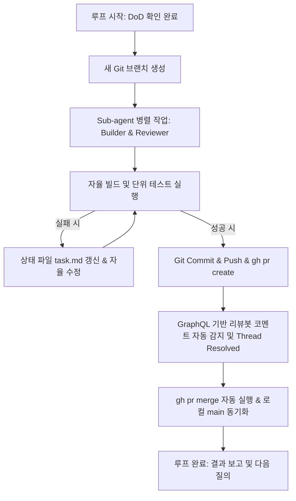

# Harness Loop Engine Skill

본 스킬은 에이전트가 단독으로 코딩을 수행할 때 발생할 수 있는 맥락 누실, 중간 승인 대기로 인한 병목, 코드 품질 저하를 방지하기 위해 **루프 엔지니어링 6대 요소(오토메이션, 워크트리, 스킬, 커넥터, 서브에이전트, 상태기억)**를 결합한 자율 하네스 엔진입니다.

---

## 1. 사전 진단 및 완료 조건 정의 (Stage A: Definition of Done)

루프를 가동하기 전, 사용자에게 다음의 완료 요건(DoD)을 명확하게 확인합니다:

1. **기능 및 UX 명세**:
   - 구현되어야 하는 대상 화면/컴포넌트/로직의 정확한 명세
   - 한 번의 루프에서 처리할 대상 범위 (단일 작업 또는 PR #N~#M 로드맵)
2. **검증 스크립트 & 자동화 규칙**:
   - 실행해야 하는 테스트 커맨드 (예: `./gradlew.bat testDebugUnitTest`)
   - 실행해야 하는 빌드 커맨드 (예: `./gradlew.bat assembleDebug`)
   - 디버그 산출물 자동 복사 대상 경로 (예: Google Drive)

---

## 2. 자율 루프 메커니즘 (Stage B: Autonomous Loop Routine)

사용자의 루프 가동 승인이 내려지면, **중간 단계별 승인 요청 없이** 완수 시까지 자율 반복 루프를 구동합니다:

### 자율 행동 세부 수칙
- **승인 최소화**: 매 빌드나 커밋, push 시점에 사용자 승인을 묻지 않는다.
- **오염 방지**: `scratch/`, 개인 환경설정, 임시 로그 등이 커밋 대상에 포함되지 않도록 `.gitignore` 및 스테이징 상태를 엄격히 검사한다.
- **리뷰봇 자율 해결**: PR 발행 후 `gh api graphql`로 리뷰 코멘트를 조회하고, 지적 사항에 따라 코드를 수정하여 커밋한 뒤 스레드를 `resolveReviewThread`로 자동 닫는다.

---

## 3. 타 프로젝트 이식 가이드 (Portability Guide)

다른 프로젝트에서 이 하네스 체계를 적용하려면 다음 단계를 수행합니다:

1. 프로젝트 루트에 `.agents/AGENTS.md` 파일을 배치하고 60줄 카파시 하네스 지침을 복사합니다.
2. 프로젝트에 맞는 테스트/빌드 커맨드를 `AGENTS.md`와 `SKILL.md`에 설정합니다.
3. Sub-agent 구성 (`define_subagent` 또는 `.agents/agents/`)을 필요에 맞춰 준비합니다.
