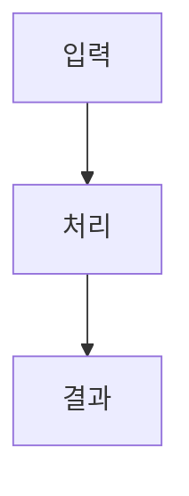

# L2C 캡처 규칙 (Log-to-Contents Pipeline)

본 스킬은 Antigravity 작업 세션을 블로그/유튜브 콘텐츠 원재료인 `devlog` 파일로 정확히 추출하고 저장하는 표준 가이드라인입니다.

## 1. 역할과 경계
- **원재료 전용**: 이 스킬은 코드가 아니라 사람이 읽을 **devlog 원재료만 생성**합니다. (블로그/유튜브 완성문 작성 및 페르소나 가공은 Claude Code `/l2c-draft` 몫)
- **한국어 & 프롬프트 보존**: 한국어로 작성하며, 사용자의 실제 프롬프트를 원문 그대로 보존합니다.
- **Claude Code 100% 호환**: 생성되는 devlog 결과물은 Claude Code의 `/l2c-draft` (페르소나 생성 엔진) 파서와 완전히 호환되어야 합니다.

## 2. 저장 경로 및 파일명/이미지 규격
- **Devlog 문서 경로**: `D:\AI\claude\L2C\devlog\<프로젝트명>\<YYYY-MM-DD>.md`
  - **경로 및 파일명 엄격 준수**: 파일명은 오직 `<YYYY-MM-DD>.md` (예: `2026-07-21.md`) 규격만 허용됩니다.
  - **절대 금지**: `l2c_batch_loop_workflow.md` 등 임의의 파일명이나 Antigravity 아티팩트(`brain/...`) 문서 생성 금지.
- **이미지 자산 경로**: `D:\AI\claude\L2C\devlog\<프로젝트명>\<YYYYMMDD>_<세션ID8자>_<설명>.png`
  - **이미지 파일명 엄격 준수**: 날짜(`YYYYMMDD`) 및 세션 ID 앞 8자를 필수 조합하여 `l2c_chat_capture.png`, `batch_loop_workflow.png` 같은 generic 파일명을 절대 금지합니다.
  - 예시: `20260721_8a2f5c10_batch_loop_workflow.png`

## 3. Devlog 포맷

```markdown
# Devlog — <YYYY-MM-DD>          ← 새 파일 생성 시에만 맨 위에 작성

<!-- L2C:SESSION <세션ID> START -->
## 세션: <한 줄 제목>
> 최종 업데이트: <YYYY-MM-DD HH:MM>  ·  ID: `<앞8자>`  ·  `Antigravity · 생성`

### 💬 내가 보낸 프롬프트
1. <원문 그대로, 1500자 제한 시 절단>

### ✏️ 편집한 파일
- `<경로>`

### ⚙️ 실행한 명령
- <한 줄 설명>

### 📊 시각화 & 인포그래픽 (Antigravity 특장점)
- 

<!-- L2C:SESSION <세션ID> END -->
```

## 4. 금지 사항 (위반 시 캡처 실패로 간주)
- **임의 문서 파일명 생성 금지**: `l2c_batch_loop_workflow.md` 등의 커스텀 파일명을 만들지 마십시오. 파일명은 오직 `<YYYY-MM-DD>.md` 규격이어야 합니다.
- **generic 이미지 파일명 생성 금지**: `l2c_chat_capture.png`, `batch_loop_workflow.png` 등 세션 ID가 누락된 파일명 절대 금지.
- **내부 아티팩트 저장 금지**: Antigravity 아티팩트(`brain/...`)로 저장하지 마십시오. 반드시 로컬 경로 `D:\AI\claude\L2C\devlog\<프로젝트명>\<YYYY-MM-DD>.md` 파일에 **Direct Write** 하십시오.
