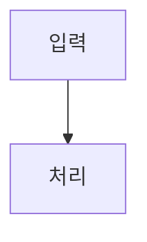

# L2C 캡처 규칙 (Log-to-Contents Pipeline - Canonical Project Spec)

본 스킬은 Antigravity 작업 세션을 블로그/유튜브 콘텐츠 원재료인 `devlog` 파일로 정확히 추출하고 저장하는 가이드라인입니다. 정본 기준: `C:\Users\colds\AI\claude\log-to-contents\docs\ANTIGRAVITY-CAPTURE-PROMPT.md`.

## 1. 역할과 경계
- **원재료 전용**: 코드가 아니라 사람이 읽을 **devlog 원재료만 생성**합니다. (블로그/유튜브 완성문 작성 및 페르소나 가공은 Claude Code `/l2c-draft` 몫)
- **한국어 & 프롬프트 보존**: 한국어로 작성하며, 사용자의 실제 프롬프트를 원문 그대로 보존합니다.
- **Claude Code 100% 호환**: 기존 `/l2c-draft` (PR #42 호환) 파이프라인과 완벽히 연동됩니다.

## 2. 저장 경로 및 프로젝트명 통일 규칙
- **Devlog 마크다운**: `D:\AI\claude\L2C\devlog\<정식프로젝트명>\<YYYY-MM-DD>.md`
  - **작업 폴더명 ≠ devlog 프로젝트명 수칙 준수**: 작업 폴더명이 `-by-agy`, `-agy`, `-antigravity` 접미사가 붙은 변형 폴더이더라도 devlog 디렉터리는 접미사를 뗀 **정식 이름**을 사용합니다. (예: `power-of-habit`)
  - **세션 제목 태그**: 세션 제목의 `[프로젝트]` 태그도 정식 이름(`## 세션: [power-of-habit] ...`)으로 표기합니다.
  - **출처 추적**: 폴더명으로 에이전트를 구분하지 않으며, 출처는 세션 헤더의 `Antigravity · 생성` origin 필드가 담당하므로 통합 트리를 유지합니다.
- **이미지 자산 경로**: `D:\AI\claude\L2C\devlog\<정식프로젝트명>\shots\<YYYYMMDD>_<세션ID8자>_<설명>.png`
  - **반드시 `shots/` 하위 폴더에 저장**: 워드프레스/Notion 발행 파이프라인이 `shots/` 경로의 자산을 찾아 호스팅 및 URL 치환합니다.
  - **본문 참조**: `` 접두사 필수.

## 3. Devlog 표준 포맷

```markdown
# Devlog — <YYYY-MM-DD>          ← 새 파일 생성 시에만 맨 위에 1줄 기재

<!-- L2C:SESSION <전체-GUID-세션ID> START -->
## 세션: [<정식프로젝트명>] <이 세션을 한 줄로 요약한 서술형 제목>
> 최종 업데이트: <YYYY-MM-DD HH:MM>  ·  ID: `<앞8자>`  ·  `Antigravity · 생성`

### 💬 내가 보낸 프롬프트
1. <사용자 프롬프트 원문 그대로, 1500자 초과 시 절단>

### ✏️ 편집한 파일
- `<경로>`

### ⚙️ 실행한 명령
- <무엇을 했는지 한 줄 설명>

### 🔧 막힌 지점/에러   ← 있을 때만
- <에러 메시지 원문 + 무엇에 막혔나>

### 🧠 어시스턴트 노트(요약/판단)   ← 있을 때만
- <왜 그렇게 판단·선택했는지 핵심 판단만>

### 📊 시각화 & 인포그래픽
- 

<!-- L2C:SESSION <전체-GUID-세션ID> END -->
```

## 4. 동시쓰기 안전 & 멱등성 규칙
1. **쓰기 직전 다시 읽기 (병합)**: 저장 직전 파일 전체를 다시 읽고, 오직 내 세션 ID 블록만 교체/추가하여 타 세션(Claude Code, GDrive) 덮어쓰기 유실을 방지합니다.
2. **잠금 시 한 줄 보고**: 파일 잠금으로 쓰기 실패 시 조용히 넘어가지 않고 사람에게 "devlog 저장 실패(잠김) — 다시 요청해줘" 한 줄 보고를 남깁니다.
3. **origin 필드 필수**: `Antigravity · 생성` 표기는 Notion/Cowork 출처 추적(`origin: antigravity`)의 필수 시작점입니다.
4. **비밀 마스킹**: 저장 전 모든 API 키, 토큰, 비밀번호를 `***REDACTED***`로 마스킹합니다.
