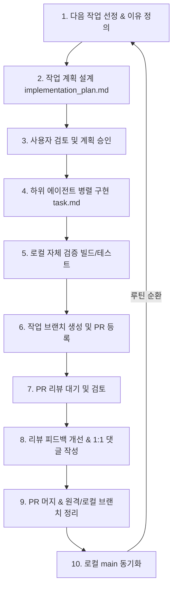

# 📋 '습관의 힘' 프로젝트 표준 워크플로우 (Standard Workflow)

본 문서는 '습관의 힘' (Power of Habit) Android 앱 개발을 수행하는 데 있어 협업, 설계, 코드 작성, 검증 및 형상 관리의 기준이 되는 **표준 워크플로우**를 정의합니다. 모든 에이전트와 기여자는 본 규칙을 준수해야 합니다.

---

## 1. 역할 분담 및 에이전트 오케스트레이션

* **설계, 검토, 검증 (Gemini 3.5 Flash High)**
  * 전체적인 기능 기획, 아키텍처 검토, 구현 계획 설계 및 최종 빌드/테스트 검증은 고추론 모델인 **High 모델**이 담당합니다.
* **작업 분배 및 병렬화**
  * High 모델이 수립한 구체적인 작업 계획에 따라, 하위 태스크(단순 코드 반영, PR 생성, 패키지 정리 등)는 적절한 하위 모델(Subagent)들에게 역할을 분배하여 **병렬 형태로 신속하게 처리**합니다.

---

## 2. 표준 업무 루틴 (Standard Work Routine)

모든 작업은 아래의 **10단계 순환 루틴**에 따라 철저하게 통제 및 실행됩니다.

### 루틴별 세부 지침

| 단계 | 프로세스 | 주요 행동 지침 |
| :--- | :--- | :--- |
| **1** | **작업 선정** | PRD를 기준으로 구현해야 할 기능 또는 이슈를 발굴하고 선정 이유를 기재합니다. |
| **2** | **계획 설계** | `implementation_plan.md` 아티팩트를 신규 작성 또는 보완하여 설계안을 정의합니다. |
| **3** | **사용자 승인** | 사용자의 명시적인 승인("좋아", "진행해" 등)을 받기 전까지는 코드를 절대 수정하지 않습니다. |
| **4** | **구현** | `task.md`를 생성해 세부 태스크를 기록하고, 하위 에이전트들을 기동하여 코드를 병렬로 개발합니다. |
| **5** | **자체 검증** | `./gradlew test compileDebugKotlin`를 실행하여 컴파일 오류 및 깨지는 테스트가 없는지 확인합니다. |
| **6** | **PR 생성** | 작업 브랜치(`feature/...`)를 생성하여 커밋하고 원격 저장소에 푸시한 뒤 GitHub PR을 개설합니다. |
| **7** | **리뷰 대기** | AI 리뷰 봇(Gemini Code Assist, Codex 등)의 코드 리뷰 코멘트가 달릴 때까지 대기합니다. |
| **8** | **피드백 개선** | 지적된 각 리뷰 스레드에 **1:1로 매칭되는 개선 답글**을 달고 `Resolved` 처리를 진행합니다. *(※ 만약 Resolved 처리가 권한 등으로 막힐 경우, 2~3회 시도 후 댓글만 달고 사용자에게 Resolved를 직접 처리하도록 요청합니다.)* |
| **9** | **브랜치 정리** | 사용자가 PR을 머지하고 원격 브랜치를 삭제하면, 로컬에서도 작업이 끝난 브랜치를 지웁니다. |
| **10** | **로컬 동기화** | 로컬 `main` 브랜치로 이동하여 원격 `main` 변경사항을 pull 받아 로컬 상태를 일치시킵니다. |

---

## 3. PR 크기 규칙 (PR Size Guideline)

> [!IMPORTANT]
> **1 PR = 1 Big Issue (단일 관심사 원칙)**
> * 하나의 PR 크기가 너무 비대해지지 않도록 주의합니다.
> * 하나의 PR은 오직 하나의 큰 이슈(예: "DB 계정 생성", "특정 UI 위젯 구현", "Hilt 주입 구성")만 해결해야 합니다. 
> * 여러 개의 독립적인 기능 요구사항을 하나의 PR에 섞어서 처리하는 것은 금지합니다.
